# StockWhisk — Data Flow Documentation

> A single reference that lets **any person or AI model** understand every major
> operation in this system: what the pieces are, how a request travels, where
> data is stored, and how money, stock, and records stay consistent.
>
> Diagrams are [Mermaid](https://mermaid.js.org/) — they render automatically on
> GitHub and in most Markdown viewers. Read top-to-bottom: it goes from the
> 10,000-ft view down to individual transactional flows.

---

## 1. What StockWhisk is

**StockWhisk** is a **multi-tenant retail ERP + Point-of-Sale (POS) SaaS**. One
deployment serves many independent shops ("tenants"). Each shop manages its own
products, inventory, sales, customers, suppliers, purchases, expenses, staff,
warranties, and repair tickets. A **platform (super) admin** operates across all
tenants.

- **Backend:** Django 5 + Django REST Framework, JWT + session auth. Serves both
  a JSON API (`/api/*`) and a **server-rendered shop UI** (the `web` app,
  mounted at `/`) built with Django templates + Alpine.js + Bootstrap.
- **Frontend (optional/alternate):** a Next.js 14 app in `frontend/` that
  reproduces the UI against the same API. The primary shipped UI is the
  server-rendered `web` app.
- **Async:** Celery workers + beat scheduler, Redis broker.
- **Data:** PostgreSQL (prod) / MySQL / SQLite (dev) — engine is env-switchable.
- **Edge:** Caddy reverse proxy (TLS, static/media).

### Tech-stack at a glance

| Concern            | Choice                                                            |
|--------------------|-------------------------------------------------------------------|
| Web framework      | Django 5, Django REST Framework                                   |
| Auth               | SimpleJWT (API) + Django sessions (server-rendered UI)            |
| Async / scheduled  | Celery worker + Celery beat (`django_celery_beat`), Redis broker  |
| Cache              | Redis (falls back to in-memory locmem)                            |
| DB                 | Postgres / MySQL / SQLite (`DB_ENGINE`)                           |
| Multi-tenancy      | Shared DB, shared schema, scoped by `shop_id`                     |
| External services  | Anthropic Claude (AI insights), WhatsApp Cloud API, SMTP email, Google Drive (backups) |
| Reverse proxy      | Caddy                                                             |

---

## 2. Level 0 — System context (who talks to the system)

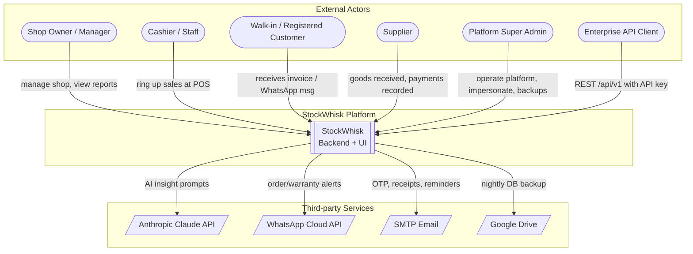

**Reading it:** humans and API clients act on the platform; the platform reaches
out to four external services for AI, messaging, email, and off-site backups.

---

## 3. Deployment / container view (docker-compose)

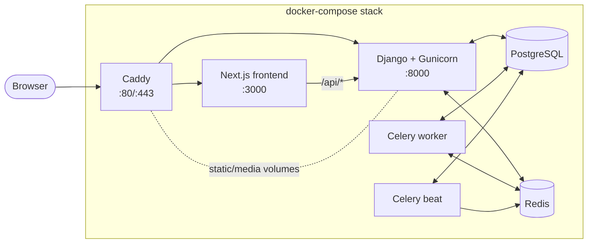

- **`backend`** — Gunicorn serving `config.wsgi` (API + server-rendered UI).
- **`worker`** — executes background jobs (emails, backups, reminders).
- **`beat`** — enqueues periodic jobs on a schedule (see §12).
- **`redis`** — Celery broker + result backend + cache.
- **`db`** — the single source of truth for all tenant data.

> When `REDIS_URL` is unset, Celery runs **eagerly** (synchronously in-process) —
> handy for local dev without Redis.

---

## 4. Multi-tenancy — the rule that governs *every* data flow

This is the single most important concept. Get it and the rest follows.

**Strategy:** *shared database, shared schema, scoped by `shop_id`.* Every
tenant-owned table has a `shop` foreign key. A request never says "give me
products" — it always effectively means "give me **this shop's** products."

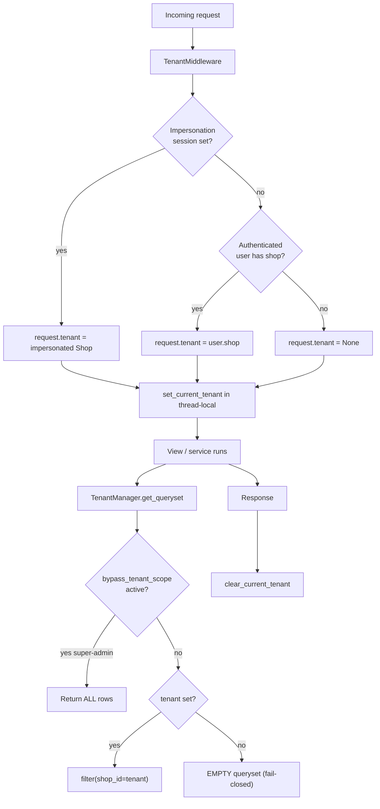

Key mechanics (in `core/`):

- **`core/middleware.py::TenantMiddleware`** resolves the tenant per request and
  stores it in a **thread-local** (`core/tenant_context.py`). It's always cleared
  at the end of the request so a reused worker thread never leaks a stale tenant.
- **`core/models.py::TenantManager`** is the default `.objects` manager on every
  `TenantScopedModel`. It auto-injects `filter(shop_id=<current tenant>)`.
  - **Fail-closed:** if no tenant is set, it returns an **empty** queryset — a
    forgotten scope can never leak another shop's data.
  - **`all_objects`** is the unscoped escape hatch (migrations, analytics,
    platform admin) that handles isolation itself.
  - **`bypass_tenant_scope()`** lets trusted cross-tenant code (super admin,
    cross-tenant analytics) opt out — deliberately verbose so it's easy to audit.
- **`TenantScopedModel.save()`** auto-stamps `shop_id` from the thread-local on
  create, preventing "forgot to set shop" bugs.

> ⚠️ Because the tenant lives in a thread-local, **Celery tasks and management
> commands must set it explicitly** via `tenant_context(shop)` or
> `set_current_tenant(shop)` — they have no middleware to do it for them.

---

## 5. Level 1 — Major processes & data stores

The system decomposes into these process clusters (Django apps) around a shared
database. Arrows show the dominant direction of data flow.

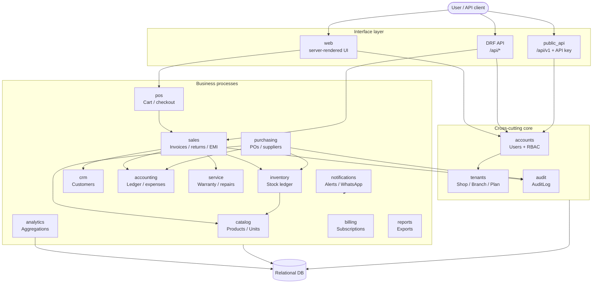

### Primary data stores (tables) and their owners

| Store (model)                     | App          | Role in the system                                             |
|-----------------------------------|--------------|----------------------------------------------------------------|
| `Shop`, `Branch`, `SubscriptionPlan`, `Subscription` | tenants   | Tenant roots + billing tier / limits                         |
| `User`, `Role`, `Permission`      | accounts     | Identity + fine-grained RBAC                                    |
| `Product`, `ProductVariation`, `ProductUnit`, `Category`, `Brand`, `Unit` | catalog | Sellable catalog; `ProductUnit` = one serialized physical item |
| `StockMovement`                   | inventory    | **Append-only stock ledger — source of truth for stock**       |
| `Sale`, `SaleItem`, `Payment`, `SaleReturn`, `SaleReturnItem`, `EMISchedule`, `EMIInstallment` | sales | Invoices, line items, receipts, returns, installments |
| `Customer`                        | crm          | Buyers, dues, loyalty, WhatsApp consent                        |
| `Supplier`, `PurchaseOrder`, `PurchaseOrderItem`, `PurchasePayment`, `SupplierPayment` | purchasing | Procurement + payables |
| `LedgerEntry`, `Expense`, `RecurringExpense`, `ExpenseCategory`, `DailySettlement` | accounting | **Append-only cash ledger**, costs, EOD settlement |
| `Warranty`, `WarrantyClaim`, `ServiceTicket`, ...  | service | Post-sale warranty + repair workflow                           |
| `AuditLog`                        | audit        | Who did what, per shop                                          |
| `Notification`, alert configs     | notifications| In-app + WhatsApp alerts                                        |
| `APIKey`                          | public_api   | Hashed keys for the Enterprise REST surface                    |

**Two ledgers are the backbone of correctness:**

1. **`StockMovement`** — every stock change is one immutable, signed row.
   `Product.current_stock` is only a **cache** derived from summing movements.
2. **`LedgerEntry`** — every cash movement (in +, out −) is one immutable row.

Because both are append-only, you can always reconstruct *why* stock or cash is
what it is — and reconcile the caches against the ledgers.

---

## 6. Authentication & onboarding flows

### 6a. Shop registration with email OTP

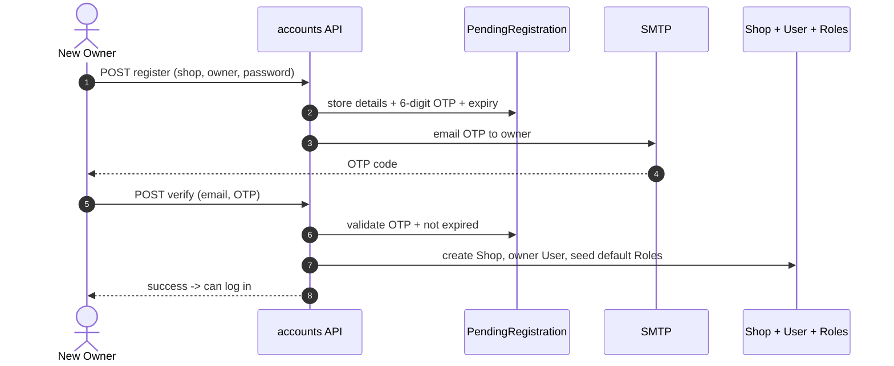

Registration details are parked in **`PendingRegistration`** until the OTP is
verified — no half-created shops. Password reset uses the same OTP pattern via
`PasswordResetOTP`.

### 6b. Login & request authorization (two auth modes)

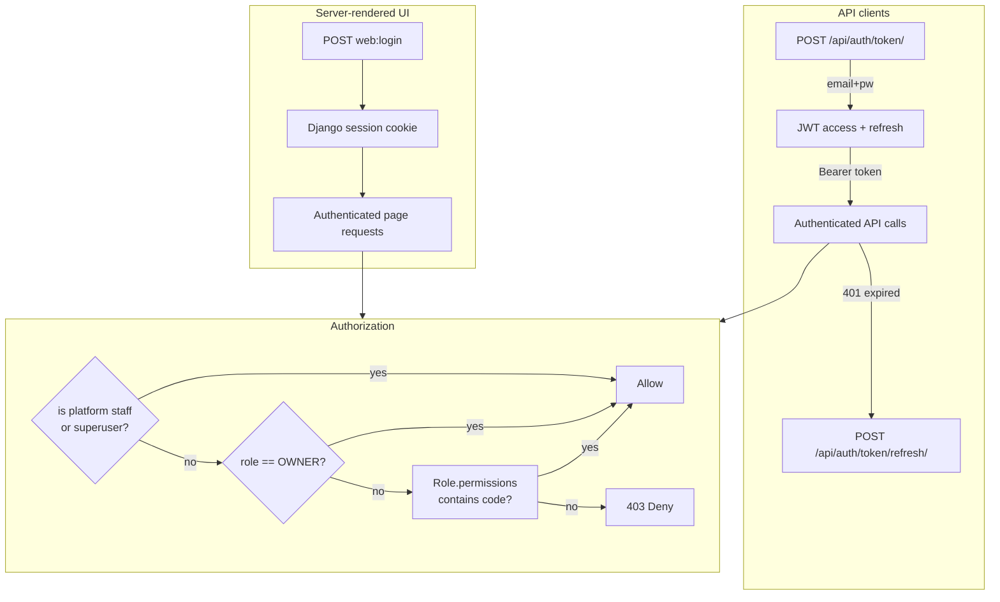

- **JWT** (`SimpleJWT`) for API clients; token endpoints are throttled `10/min`
  per IP as a brute-force guard. Access token 60 min, refresh 7 days.
- **Session** auth for the server-rendered UI.
- **RBAC** (`accounts/models.py::User.has_perm_code`): platform staff and shop
  **owners** get everything; other roles resolve fine-grained permission codes
  (e.g. `view_profit`, `delete_sale`, `manage_users`) through their shop's
  editable `Role` rows. The UI reads `/api/auth/my-permissions/` to gate the
  sidebar and actions.

---

## 7. ⭐ The core transaction — POS sale / checkout

This is the transactional heart of the app (`sales/services.py::create_sale`).
**Everything happens in one atomic DB transaction** — if any step fails, nothing
commits.

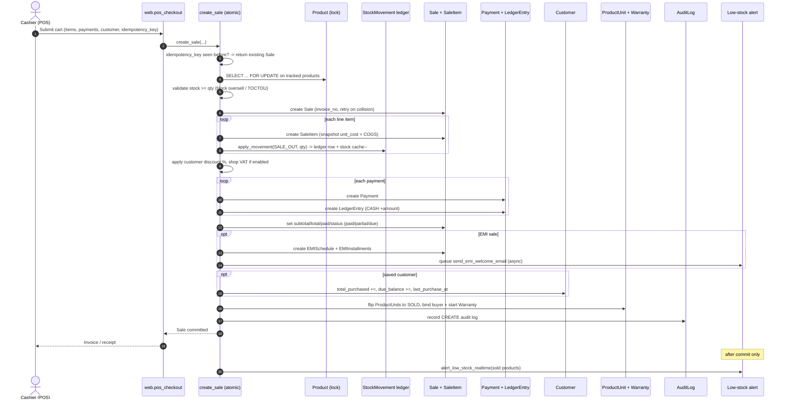

### Why each guard exists

| Guard | Problem it prevents |
|-------|---------------------|
| `idempotency_key` (unique per shop) | Double-click / retry creating **duplicate sales** |
| `select_for_update()` on products | Two concurrent checkouts both passing the stock check and **overselling into negative** (TOCTOU) |
| `invoice_no` retry loop | Two sales computing the same `count()+1` invoice number → unique-constraint 500 |
| `unit_cost` **snapshot** on `SaleItem` | Later cost changes silently rewriting historical **COGS / profit** |
| `transaction.on_commit` for alerts | Alerting on a sale that **rolled back** |
| One atomic block | Partial writes: stock moved but payment lost, etc. |

**Data touched by one checkout:** `Sale`, `SaleItem`, `Payment`, `LedgerEntry`,
`StockMovement`, `Product.current_stock`, `ProductUnit`, `Warranty`, `Customer`,
optionally `EMISchedule`/`EMIInstallment`, and `AuditLog`.

---

## 8. Inventory — the append-only stock ledger

Stock is **never edited directly**. The only sanctioned mutation is
`inventory/services.py::apply_movement`, which writes an immutable
`StockMovement` and nudges the `current_stock` cache.

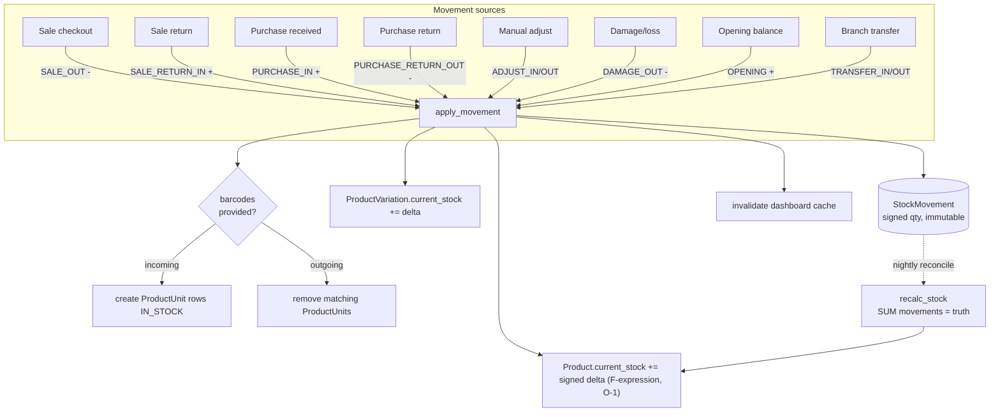

- **Sign convention:** outgoing types (`SALE_OUT`, `DAMAGE_OUT`, `ADJUST_OUT`,
  `PURCHASE_RETURN_OUT`, `TRANSFER_OUT`) store **negative** quantities; summing
  the column yields current stock.
- **Cache vs. truth:** the hot path updates `current_stock` incrementally with a
  DB-side `F()` expression (atomic, O(1)). The nightly `reconcile_stock` task
  re-sums the ledger as the authoritative repair — a drift safety net.
- **`restock()`** additionally rolls `Product.cost_price` into a **weighted
  average** so margins stay honest when purchase prices change.
- **`ProductUnit`** = one physically serialized item (its own barcode). A POS
  scan resolves a unit barcode → product + per-unit price/warranty snapshot.

---

## 9. Purchasing — procurement to payables

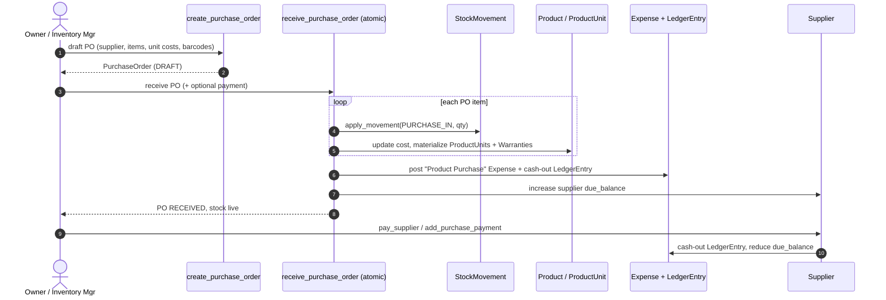

Receiving a PO is where procurement becomes real stock **and** a real cost:
inventory goes up via the ledger, cost/units are recorded, and the spend hits
accounting (an `Expense` + a negative `LedgerEntry`). Supplier payables track
`Supplier.due_balance`.

---

## 10. Returns, EMI, and dues

### 10a. Sale return (partial or full)

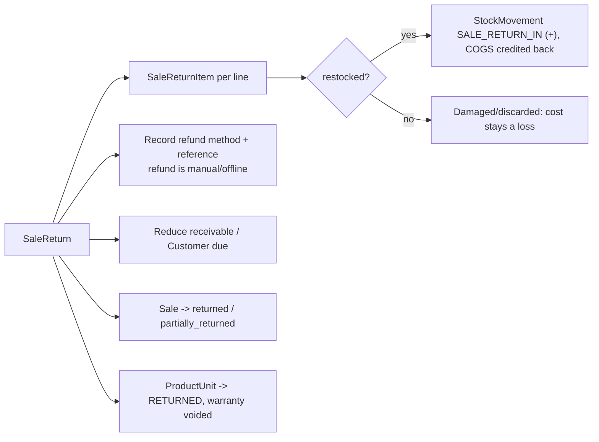

Refunds are **recorded, not executed** — the system tracks method + reference;
no live payout gateway. `restocked=True` credits COGS back (goods weren't truly
sold); `False` keeps the cost as a loss.

### 10b. EMI (installment sales)

`create_sale(is_emi=True)` builds an **`EMISchedule`** + N **`EMIInstallment`**
rows (principal + interest − down payment, spread monthly with rounding put on
the last installment). A welcome email is queued async; `send_emi_reminders`
(scheduled) chases upcoming/overdue installments.

### 10c. Customer dues (receivables)

`collect_customer_due` allocates a payment **oldest-invoice-first (FIFO)** across
a customer's open sales; each allocation flows through `add_payment` so per-sale
status, the cash `LedgerEntry`, and `Customer.due_balance` all stay consistent.

---

## 11. Accounting & profit (transparent, never faked)

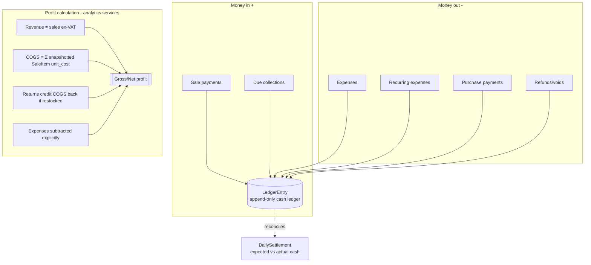

- **VAT is a pass-through liability**, not revenue: it inflates the invoice total
  (what the customer owes) but is excluded from profit.
- **COGS is honest**: computed from the `unit_cost` snapshotted on each
  `SaleItem` at sale time, never `selling − purchase` at report time.
- **`DailySettlement`** closes a shift/day: expected vs actual cash, discrepancy.

---

## 12. Asynchronous & scheduled data flows (Celery)

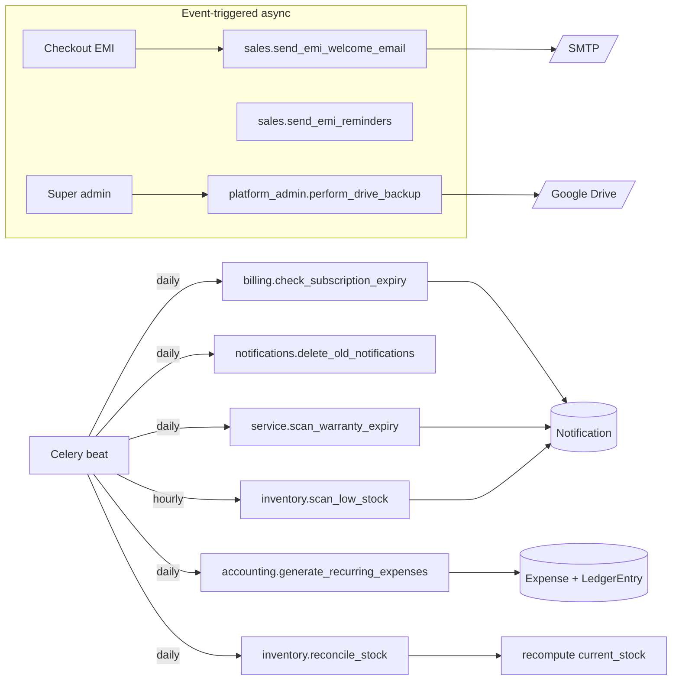

| Task | Cadence | What it does |
|------|---------|--------------|
| `inventory.scan_low_stock` | hourly | Digest low-stock alerts for DAILY-mode shops |
| `inventory.reconcile_stock` | daily | Re-sum ledger → repair `current_stock` drift |
| `billing.check_subscription_expiry` | daily | Flag/expire subscriptions past period end |
| `accounting.generate_recurring_expenses` | daily | Materialize `RecurringExpense` → `Expense` |
| `service.scan_warranty_expiry` | daily | Warn on warranties nearing expiry |
| `notifications.delete_old_notifications` | daily | Prune old in-app notifications |
| `sales.send_emi_welcome_email` / `send_emi_reminders` | event / scheduled | EMI comms |
| `platform_admin.perform_drive_backup` | on demand | DB dump → Google Drive |

> Remember §4: each task must set the tenant context for the shop it operates on.

---

## 13. Notifications & external messaging

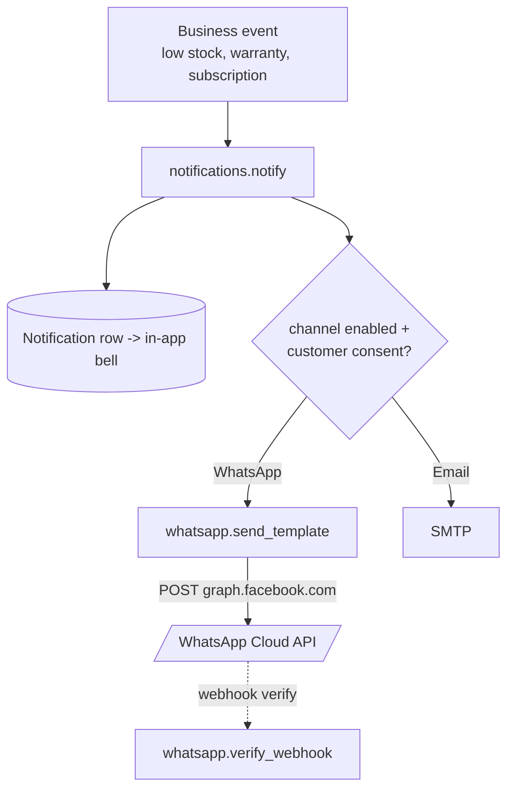

- **In-app**: `Notification` rows drive the notification bell.
- **WhatsApp**: `notifications/whatsapp.py::send_template` POSTs to the Meta
  Graph API; gated on channel config **and** per-customer consent
  (`Customer.whatsapp_consent`). Degrades gracefully when unconfigured.
- **Email**: console backend in dev, SMTP in prod; a missing host simply means
  no email is sent (never blocks a request).

---

## 14. AI insights (Anthropic Claude)

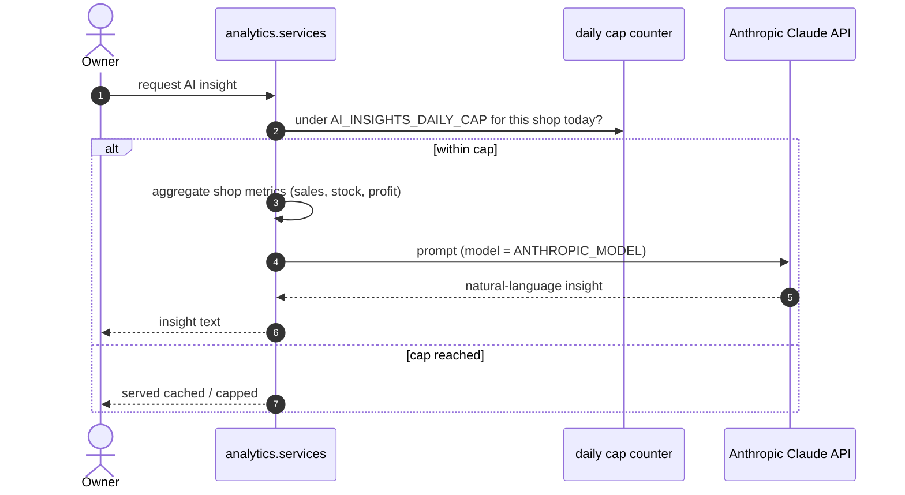

Configured in `config/settings.py`: `ANTHROPIC_API_KEY`, `ANTHROPIC_MODEL`
(default `claude-opus-4-8`), and `AI_INSIGHTS_DAILY_CAP` (Claude calls per shop
per day) to bound cost. Only **aggregated** shop metrics are sent — never raw
customer PII dumps.

---

## 15. Platform admin (cross-tenant) & the public API

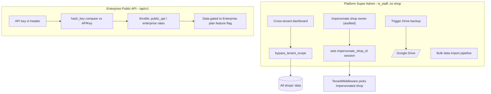

- **Super admin** uses `bypass_tenant_scope()` for cross-tenant views and can
  **impersonate** an owner (sets a session key the middleware honors — see §4),
  with actions written to `AuditLog`.
- **Public API** (`/api/v1`) authenticates via **hashed API keys**, is
  rate-limited per key, and its data surface is **gated to the Enterprise plan**
  through the feature-flag system on `SubscriptionPlan.features`.

---

## 16. Feature gating & subscription limits

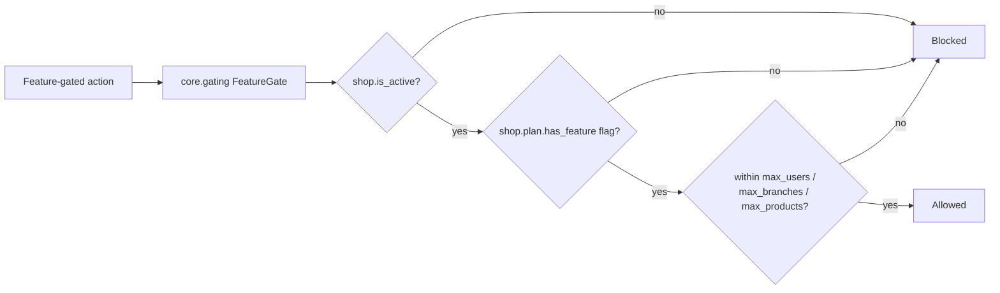

`SubscriptionPlan` carries a JSON `features` map (editable without migrations)
plus hard limits (`max_users`, `max_branches`, `max_products`).
`Shop.has_feature()` is the central check used by the `FeatureGate`
permission/decorator.

---

## 17. End-to-end example — one item, cradle to grave

Following a single physical phone through the system ties every flow together:

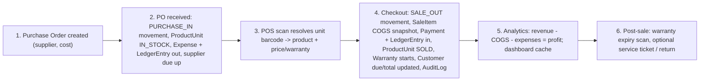

Every step leaves an **immutable ledger row** (stock and/or cash) plus an
**audit trail**, so the state is always explainable and reconcilable.

---

## 18. Cross-cutting invariants (the rules that keep data honest)

1. **Tenant isolation is default-on and fail-closed.** No tenant → no rows.
2. **Stock and cash are append-only ledgers;** cached balances are derived and
   reconcilable, never authoritative.
3. **Costs are snapshotted at transaction time** so historical profit is stable.
4. **Money-moving operations are atomic** — all-or-nothing DB transactions.
5. **Idempotency + row locking** guard the checkout hot path against duplicates
   and overselling.
6. **Refunds/payouts are recorded, not executed** — no live financial gateway.
7. **Every significant mutation is audited** (`AuditLog`) per shop.
8. **External calls degrade gracefully** — missing WhatsApp/email/AI config never
   breaks a core flow.

---

### Where to look in the code

| To understand… | Start at |
|----------------|----------|
| Multi-tenancy | `backend/core/middleware.py`, `backend/core/tenant_context.py`, `backend/core/models.py` |
| A sale end-to-end | `backend/sales/services.py::create_sale` |
| Stock movement | `backend/inventory/services.py::apply_movement` |
| Purchasing | `backend/purchasing/services.py` |
| Accounting/profit | `backend/accounting/models.py`, `backend/analytics/services.py` |
| RBAC | `backend/accounts/models.py`, `backend/accounts/rbac.py` |
| Server-rendered UI routes | `backend/web/urls.py`, `backend/web/views.py` |
| API routes | `backend/config/urls.py` + each app's `urls.py` |
| Scheduled jobs | `backend/config/celery.py` + each app's `tasks.py` |
| Feature gating | `backend/core/gating.py`, `backend/tenants/models.py` |

---

*Generated from a source-code walkthrough of the StockWhisk backend. Diagrams are
Mermaid; view on GitHub or any Mermaid-aware Markdown renderer.*
