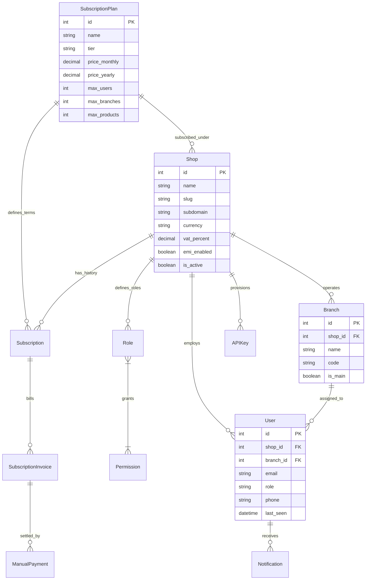
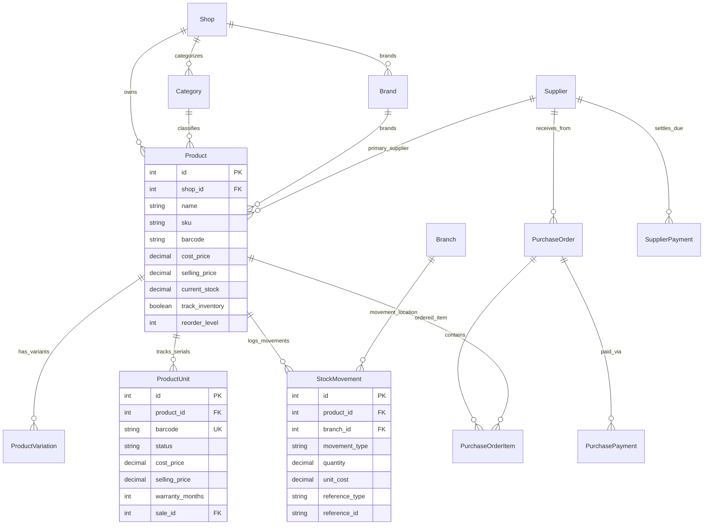
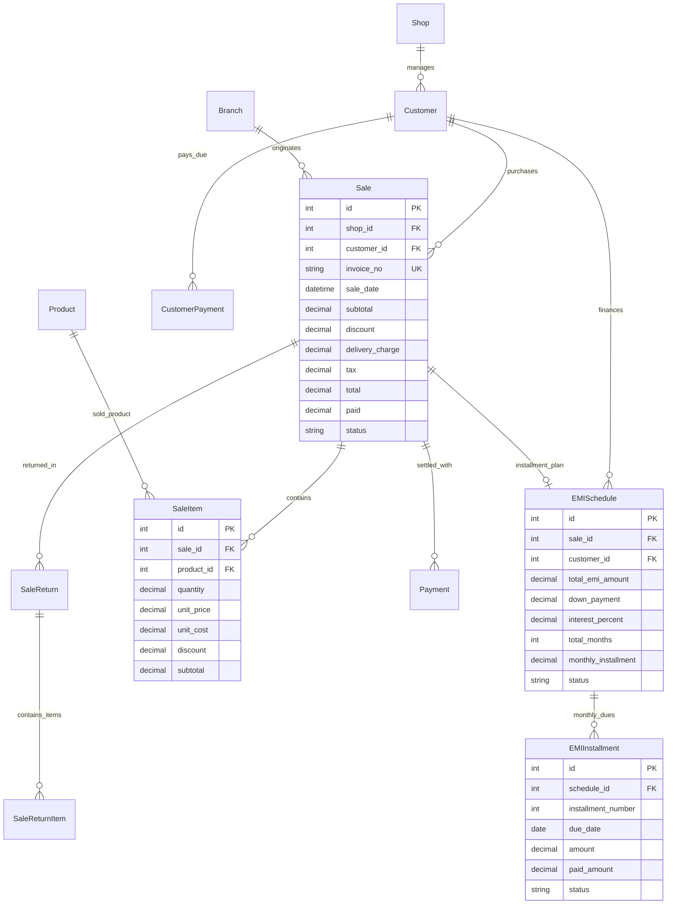
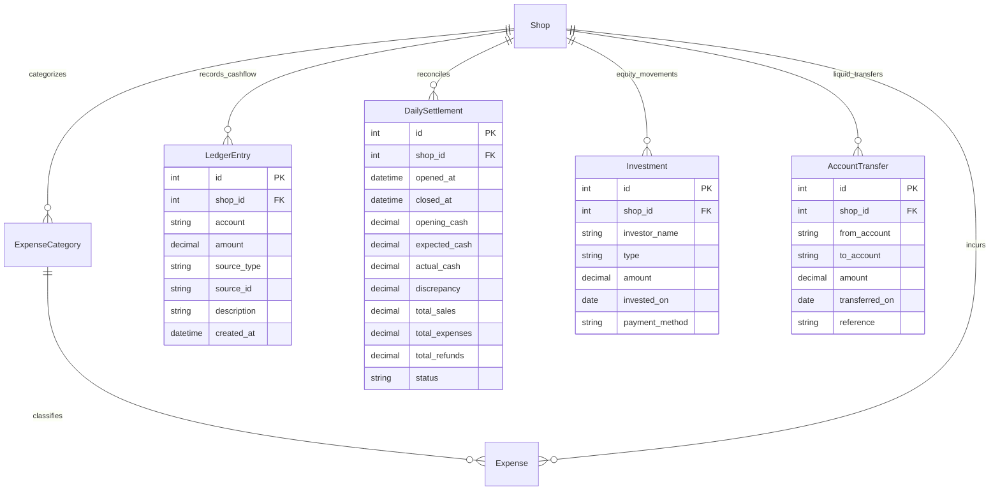
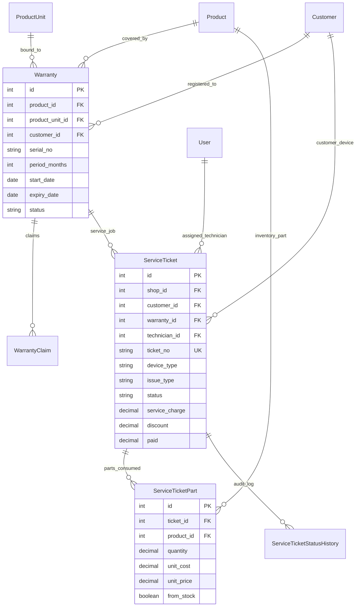

# 16. StockWhisk Database Schema & Entity-Relationship (ER) Specification

## 1. Executive Summary & Architecture Overview

The StockWhisk relational database architecture is engineered as a **Multi-Tenant SaaS Retail ERP, POS, RMA Service, and Financial Accounting engine**. It is built on Django ORM with native support for PostgreSQL (Production), MySQL, and SQLite (Local Development).

### Core Architectural Principles:
1. **Tenant Isolation by Construction**: All business entities inherit from `TenantScopedModel` (via `core.models.TenantScopedModel`), which automatically injects a `shop_id` foreign key and enforces tenant query filtering through `TenantManager`.
2. **Immutable Financial & Stock Ledgers (Event-Sourced)**: 
   - Cash/Bank movements are logged into the append-only `LedgerEntry` table.
   - Physical warehouse movements are recorded in the append-only `StockMovement` table.
   - Derived quantities (`Product.current_stock`, `Customer.due_balance`, `Supplier.due_balance`) are cached projections protected by database constraints and atomic transactions.
3. **Dual-Layer Inventory Tracking**:
   - Standard bulk inventory tracked by quantity.
   - High-value serialized inventory tracked per individual physical piece (`ProductUnit`) with unique barcodes and serialized lifecycle states.

---

## 2. High-Level Entity-Relationship (ER) Diagrams

### 2.1 Core Multi-Tenancy, Auth & Subscriptions ERD



---

### 2.2 Product Catalog, Purchasing & Stock Movements ERD



---

### 2.3 POS Sales, Invoicing, Returns, CRM & EMI ERD



---

### 2.4 Financial Accounting, Daily Settlement & Cash Flow ERD



---

### 2.5 RMA Warranty & Repair Services ERD



---

## 3. Complete Data Dictionary (Table by Table)

### 3.1 App: `tenants`

#### Table: `tenants_subscriptionplan`
*Defines global SaaS billing tiers, feature quotas, and limits.*

| Column | Type | Nullable | Constraints | Description |
|---|---|---|---|---|
| `id` | BigAutoField | No | PK | Primary Key |
| `name` | CharField(100) | No | | Display name (e.g. Free, Basic, Pro, Enterprise) |
| `tier` | CharField(20) | No | Enum (`FREE`, `BASIC`, `PROFESSIONAL`, `ENTERPRISE`) | Plan tier identifier |
| `price_monthly` | DecimalField(10,2) | No | Default `0.00` | Monthly billing price |
| `price_yearly` | DecimalField(10,2) | No | Default `0.00` | Yearly billing price |
| `features` | JSONField | No | Default `list` | Active feature toggles |
| `max_users` | PositiveIntegerField | No | Default `1` | Max user limit |
| `max_branches` | PositiveIntegerField | No | Default `1` | Max branches allowed |
| `max_products` | PositiveIntegerField | No | Default `100` | Max product catalog size |
| `is_active` | BooleanField | No | Default `True` | Whether plan is purchasable |

#### Table: `tenants_shop`
*The root tenant partition representing an independent business.*

| Column | Type | Nullable | Constraints | Description |
|---|---|---|---|---|
| `id` | BigAutoField | No | PK | Primary Key |
| `name` | CharField(150) | No | | Legal / Commercial business name |
| `slug` | SlugField(160) | No | Unique | URL slug |
| `subdomain` | CharField(63) | Yes | Unique | Optional dedicated subdomain |
| `logo` | ImageField | Yes | | Uploaded business brand logo |
| `phone` | CharField(20) | No | | Primary contact phone |
| `email` | EmailField | Yes | | Primary business notification email |
| `currency` | CharField(10) | No | Default `'BDT'` | Currency code (BDT, USD, etc.) |
| `vat_enabled` | BooleanField | No | Default `False` | Whether VAT is charged on sales |
| `vat_percent` | DecimalField(5,2) | No | Default `0.00` | Percentage rate of VAT |
| `emi_enabled` | BooleanField | No | Default `True` | Enable installment sales |
| `offline_sale_mode` | BooleanField | No | Default `False` | Enable offline cached POS sync |
| `plan_id` | ForeignKey | Yes | FK -> `tenants_subscriptionplan` | Current active subscription plan |
| `trial_ends_at` | DateTimeField | Yes | | Free trial expiration timestamp |
| `is_active` | BooleanField | No | Default `True` | Active shop status |
| `is_demo` | BooleanField | No | Default `False` | Public read-only demo shop |
| `is_free` | BooleanField | No | Default `False` | Lifetime free granted shop |

#### Table: `tenants_branch`
*Physical outlet / warehouse branches under a single tenant shop.*

| Column | Type | Nullable | Constraints | Description |
|---|---|---|---|---|
| `id` | BigAutoField | No | PK | Primary Key |
| `shop_id` | ForeignKey | No | FK -> `tenants_shop` | Parent tenant shop |
| `name` | CharField(100) | No | | Branch name (e.g. Main Branch, Gulshan Outlet) |
| `code` | CharField(20) | Yes | | Unique branch short code |
| `phone` | CharField(20) | Yes | | Branch telephone / mobile |
| `address` | TextField | Yes | | Physical location address |
| `is_main` | BooleanField | No | Default `False` | Designates primary headquarters branch |
| `is_active` | BooleanField | No | Default `True` | Branch operational status |

---

### 3.2 App: `accounts`

#### Table: `accounts_user`
*System user accounts (Cashiers, Managers, Owners, Resellers, Platform Superadmins).*

| Column | Type | Nullable | Constraints | Description |
|---|---|---|---|---|
| `id` | BigAutoField | No | PK | Primary Key |
| `email` | EmailField | No | Unique | Unique login identifier |
| `shop_id` | ForeignKey | Yes | FK -> `tenants_shop` | Scoped tenant shop (null for platform admin) |
| `branch_id` | ForeignKey | Yes | FK -> `tenants_branch` | Scoped branch (null for all-branch managers) |
| `role` | CharField(20) | No | Enum (`OWNER`, `MANAGER`, `CASHIER`, `STAFF`, `RESELLER`, `PLATFORM_ADMIN`) | User role type |
| `phone` | CharField(20) | Yes | | Contact mobile number |
| `is_staff` | BooleanField | No | Default `False` | Platform administration access |
| `last_seen` | DateTimeField | Yes | | Timestamp of last user API activity |

#### Table: `accounts_role` & `accounts_permission`
*Granular role-based access control (RBAC).*

| Table | Key Columns | Description |
|---|---|---|
| `accounts_permission` | `code` (Unique), `name`, `category`, `description` | Global catalog of permissions (e.g. `create_sale`, `manage_expenses`) |
| `accounts_role` | `shop_id`, `name`, `role_type`, `is_system` | Tenant-defined customizable permission roles |
| `accounts_role_permissions` | `role_id` (FK), `permission_id` (FK) | Many-to-Many junction table for RBAC |

---

### 3.3 App: `catalog`

#### Table: `catalog_product`
*Master physical and service product inventory items.*

| Column | Type | Nullable | Constraints | Description |
|---|---|---|---|---|
| `id` | BigAutoField | No | PK | Primary Key |
| `shop_id` | ForeignKey | No | FK -> `tenants_shop` | Tenant owner |
| `name` | CharField(200) | No | | Product title / model name |
| `sku` | CharField(100) | Yes | Index | Stock Keeping Unit |
| `barcode` | CharField(100) | Yes | Index | Primary retail barcode (EAN-13, Code128, etc.) |
| `category_id` | ForeignKey | Yes | FK -> `catalog_category` | Product category classification |
| `brand_id` | ForeignKey | Yes | FK -> `catalog_brand` | Brand / Manufacturer |
| `unit_id` | ForeignKey | Yes | FK -> `catalog_unit` | Unit of measure (Pcs, Box, Kg, Liter) |
| `supplier_id` | ForeignKey | Yes | FK -> `purchasing_supplier` | Default vendor |
| `cost_price` | DecimalField(12,2) | No | Default `0.00` | Latest unit purchase cost price |
| `selling_price` | DecimalField(12,2) | No | Default `0.00` | Standard retail selling price |
| `track_inventory`| BooleanField | No | Default `True` | If `False`, item is untracked service/fee |
| `current_stock` | DecimalField(12,2) | No | Default `0.00` | Cached on-hand inventory quantity |
| `reorder_level` | PositiveIntegerField| No | Default `5` | Safety stock threshold for alerts |
| `warranty_months`| PositiveSmallInt | No | Default `0` | Standard warranty duration in months |
| `replacement_guarantee_days`| PositiveSmallInt | No | Default `0` | Replacement coverage in days |

#### Table: `catalog_productunit`
*High-precision serialized unit tracking (IMEI, unique serial numbers).*

| Column | Type | Nullable | Constraints | Description |
|---|---|---|---|---|
| `id` | BigAutoField | No | PK | Primary Key |
| `shop_id` | ForeignKey | No | FK -> `tenants_shop` | Tenant owner |
| `product_id` | ForeignKey | No | FK -> `catalog_product` | Parent catalog product |
| `barcode` | CharField(100) | No | Unique per product | Unique serial / IMEI barcode |
| `status` | CharField(20) | No | Enum (`IN_STOCK`, `SOLD`, `TESTING_PENDING`, `DEFECTIVE`, `RETURNED_SUPPLIER`) | Physical unit status |
| `cost_price` | DecimalField(12,2) | No | | Snapshotted purchase cost of this unit |
| `selling_price`| DecimalField(12,2) | No | | Snapshotted selling price |
| `sale_id` | ForeignKey | Yes | FK -> `sales_sale` | Linked sale invoice when sold |
| `sold_at` | DateTimeField | Yes | | Timestamp when unit was sold |

---

### 3.4 App: `inventory`

#### Table: `inventory_stockmovement`
*Immutable, append-only warehouse stock ledger.*

| Column | Type | Nullable | Constraints | Description |
|---|---|---|---|---|
| `id` | BigAutoField | No | PK | Primary Key |
| `shop_id` | ForeignKey | No | FK -> `tenants_shop` | Tenant owner |
| `product_id` | ForeignKey | No | FK -> `catalog_product` | Modified product |
| `branch_id` | ForeignKey | Yes | FK -> `tenants_branch` | Branch location where stock changed |
| `movement_type`| CharField(30) | No | Enum (`PURCHASE_IN`, `SALE_OUT`, `SALE_RETURN_IN`, `ADJUSTMENT_IN`, `ADJUSTMENT_OUT`, `DAMAGE_OUT`, `TRANSFER_IN`, `TRANSFER_OUT`, `SERVICE_CONSUMED`) | Nature of stock change |
| `quantity` | DecimalField(12,2) | No | | Positive or negative delta quantity |
| `unit_cost` | DecimalField(12,2) | No | | Snapshotted unit cost at movement time |
| `reference_type`| CharField(50) | Yes | | Source model name (e.g. `'Sale'`, `'PurchaseOrder'`) |
| `reference_id` | CharField(100) | Yes | | Source transaction ID or invoice number |
| `created_by_id`| ForeignKey | Yes | FK -> `accounts_user` | Operator who executed the movement |
| `created_at` | DateTimeField | No | Auto Now Add | Movement execution timestamp |

---

### 3.5 App: `sales` & `pos`

#### Table: `sales_sale`
*Master sales invoice document.*

| Column | Type | Nullable | Constraints | Description |
|---|---|---|---|---|
| `id` | BigAutoField | No | PK | Primary Key |
| `shop_id` | ForeignKey | No | FK -> `tenants_shop` | Tenant owner |
| `invoice_no` | CharField(50) | No | Unique per shop | System generated memo number |
| `customer_id`| ForeignKey | Yes | FK -> `crm_customer` | Registered customer (or null for walk-in) |
| `customer_name`| CharField(150) | Yes | | Walk-in buyer name |
| `customer_phone`| CharField(20) | Yes | | Walk-in buyer contact number |
| `sale_date` | DateTimeField | No | Index | Timestamp of checkout |
| `subtotal` | DecimalField(12,2) | No | Default `0.00` | Gross sum of all items |
| `discount` | DecimalField(12,2) | No | Default `0.00` | Total discount deducted |
| `delivery_charge`| DecimalField(12,2)| No | Default `0.00` | Shipping / courier fee |
| `tax` | DecimalField(12,2) | No | Default `0.00` | Computed VAT amount |
| `total` | DecimalField(12,2) | No | Default `0.00` | Net payable: `subtotal - discount + delivery + tax` |
| `paid` | DecimalField(12,2) | No | Default `0.00` | Total cash/digital amount received |
| `status` | CharField(20) | No | Enum (`PAID`, `PARTIAL`, `DUE`, `CANCELLED`, `QUOTATION`) | Invoicing payment status |
| `idempotency_key`| CharField(100)| Yes | Unique | Prevents duplicate POS checkouts |

#### Table: `sales_saleitem`
*Individual product line items within a sales invoice.*

| Column | Type | Nullable | Constraints | Description |
|---|---|---|---|---|
| `id` | BigAutoField | No | PK | Primary Key |
| `sale_id` | ForeignKey | No | FK -> `sales_sale` | Parent sales invoice |
| `product_id` | ForeignKey | No | FK -> `catalog_product` | Sold catalog product |
| `quantity` | DecimalField(12,2) | No | | Quantity sold |
| `unit_price` | DecimalField(12,2) | No | | Selling price charged per unit |
| `unit_cost` | DecimalField(12,2) | No | | Snapshotted purchase cost (for COGS & profit) |
| `discount` | DecimalField(12,2) | No | Default `0.00` | Item level discount |
| `subtotal` | DecimalField(12,2) | No | | Net line amount |

#### Table: `sales_emischedule` & `sales_emiinstallment`
*Financed installment sales plans.*

| Column | Type | Nullable | Constraints | Description |
|---|---|---|---|---|
| `id` | BigAutoField | No | PK | Primary Key |
| `sale_id` | OneToOneField | No | FK -> `sales_sale` | Linked sale invoice |
| `customer_id`| ForeignKey | No | FK -> `crm_customer` | Financed customer |
| `total_emi_amount`| DecimalField(12,2)| No | | Principal + total interest |
| `down_payment`| DecimalField(12,2)| No | | Upfront initial cash paid |
| `interest_percent`| DecimalField(5,2)| No | Default `0.00` | Interest rate charged |
| `total_months`| PositiveSmallInt | No | | Number of installment months |
| `monthly_installment`| DecimalField(12,2)| No | | Monthly amount due |
| `status` | CharField(20) | No | Enum (`ACTIVE`, `COMPLETED`, `DEFAULTED`) | EMI schedule health |

---

### 3.6 App: `accounting`

#### Table: `accounting_ledgerentry`
*Append-only double-entry financial cash flow tracking table.*

| Column | Type | Nullable | Constraints | Description |
|---|---|---|---|---|
| `id` | BigAutoField | No | PK | Primary Key |
| `shop_id` | ForeignKey | No | FK -> `tenants_shop` | Tenant owner |
| `account` | CharField(20) | No | Enum (`CASH`, `BKASH`, `NAGAD`, `BANK`, `CARD`, `OTHER`) | Specific liquid account |
| `amount` | DecimalField(12,2) | No | | Positive (Inflow) or Negative (Outflow) |
| `source_type`| CharField(50) | No | | Event type (`SALE`, `EXPENSE`, `DUE_COLLECT`, `PURCHASE`, `TRANSFER`, `INVESTMENT`, `DRAWING`) |
| `source_id` | CharField(100) | Yes | | Foreign source record ID |
| `description`| CharField(255) | Yes | | Human-readable audit narrative |
| `created_at` | DateTimeField | No | Auto Now Add | Financial entry timestamp |

#### Table: `accounting_dailysettlement`
*Daily shift reconciliation and cash drawer closing audits.*

| Column | Type | Nullable | Constraints | Description |
|---|---|---|---|---|
| `id` | BigAutoField | No | PK | Primary Key |
| `shop_id` | ForeignKey | No | FK -> `tenants_shop` | Tenant owner |
| `opened_at` | DateTimeField | No | | Shift opening timestamp |
| `closed_at` | DateTimeField | Yes | | Shift closing timestamp |
| `opening_cash`| DecimalField(12,2)| No | | Carryover cash from previous shift |
| `expected_cash`| DecimalField(12,2)| No | | System calculated cash: `opening + sales - expenses` |
| `actual_cash` | DecimalField(12,2)| Yes | | Manually counted cash in physical drawer |
| `discrepancy` | DecimalField(12,2)| Yes | | Variance: `actual_cash - expected_cash` |
| `status` | CharField(20) | No | Enum (`OPEN`, `CLOSED`) | Shift register state |

---

### 3.7 App: `service`

#### Table: `service_warranty` & `service_serviceticket`
*Warranty lifecycle and repair center job card management.*

| Table | Key Columns | Description |
|---|---|---|
| `service_warranty` | `product_id`, `product_unit_id`, `customer_id`, `serial_no`, `period_months`, `start_date`, `expiry_date`, `status` | Warranty registration bound to individual serial units. |
| `service_serviceticket` | `ticket_no`, `customer_id`, `warranty_id`, `technician_id`, `device_type`, `issue_type`, `complaint`, `status`, `service_charge`, `discount`, `paid` | Service job card state machine (`RECEIVED` → `DIAGNOSING` → `AWAITING_PARTS` → `IN_REPAIR` → `READY` → `DELIVERED`). |
| `service_serviceticketpart` | `ticket_id`, `product_id`, `quantity`, `unit_cost`, `unit_price`, `from_stock` | Replacement spare parts used in repair with optional automated inventory deduction. |

---

## 4. Key Database Constraints & Integrity Rules

```sql
-- 1. Strict Tenant Scoping Unique Constraints
ALTER TABLE catalog_product 
ADD CONSTRAINT uniq_sku_per_shop_when_set 
UNIQUE (shop_id, sku);

ALTER TABLE catalog_productunit 
ADD CONSTRAINT uniq_unit_barcode_per_product 
UNIQUE (shop_id, product_id, barcode);

ALTER TABLE sales_sale 
ADD CONSTRAINT uniq_invoice_per_shop 
UNIQUE (shop_id, invoice_no);

ALTER TABLE service_serviceticket 
ADD CONSTRAINT uniq_ticket_no_per_shop 
UNIQUE (shop_id, ticket_no);

-- 2. Non-Negative Financial Amounts (Check Constraints)
ALTER TABLE sales_payment 
ADD CONSTRAINT payment_amount_positive 
CHECK (amount > 0);

ALTER TABLE accounting_expense 
ADD CONSTRAINT expense_amount_positive 
CHECK (amount >= 0);

ALTER TABLE accounting_investment 
ADD CONSTRAINT investment_amount_positive 
CHECK (amount >= 0);
```

---

## 5. Summary Index Statistics

| App Area | Total Models | Core Database Tables | Key Foreign Keys | Unique Constraints |
|---|---|---|---|---|
| **Tenants & Core** | 4 | 4 | 6 | 3 |
| **Auth & Accounts** | 5 | 6 | 4 | 2 |
| **Catalog & Products** | 6 | 6 | 8 | 5 |
| **Inventory & Movements** | 1 | 1 | 3 | 1 |
| **CRM & Customers** | 2 | 2 | 2 | 1 |
| **Purchasing & Vendors** | 5 | 5 | 7 | 2 |
| **Sales, POS & EMI** | 7 | 7 | 10 | 4 |
| **Finance & Accounting** | 7 | 7 | 5 | 3 |
| **Service & Warranty** | 5 | 5 | 8 | 2 |
| **Platform & Billing** | 12 | 12 | 6 | 2 |
| **TOTALS** | **54 Models** | **55 Tables** | **59 Relations** | **25 Constraints** |
